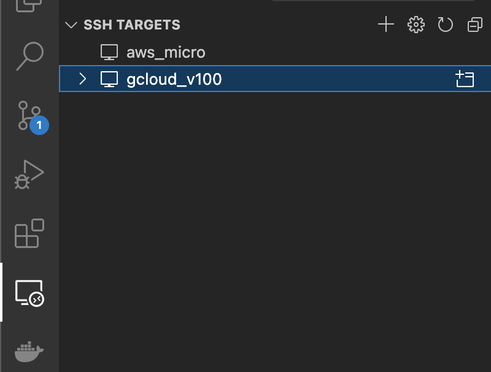

- [GPU 할당량 증가 요청](#gpu-할당량-증가-요청)
  - [Compute Engine](#compute-engine)
  - [Vertex AI](#vertex-ai)
- [Compute Engine 시작하기](#compute-engine-시작하기)
- [로컬 환경 세팅](#로컬-환경-세팅)
  - [Google Cloud CLI 설치 및 SSH 키 등록](#google-cloud-cli-설치-및-ssh-키-등록)
- [마치며](#마치며)
# GPU 할당량 증가 요청
Google Cloud를 사용하기로 결정하고 제일 먼저 한 일은 Vertex AI Workbench를 사용해보는 일이었습니다. 그런데 이게 웬걸, 한국에서는 A100 밖에 지원을 안하는데, 사용하려면 할당량 증가를 요청해야합니다. 

할당량은 IAM 및 관리자 메뉴에서 가장 아래에 있습니다. 그런데 이게 검색하기도 직관적이지 않습니다. 

## Compute Engine
우선 필터에서 gpus_all을 치면 나오는 compute.googleapis.com/gpus_all_regions를 0에서 할당량 수정을 통해서 증가 요청을 합니다.
Compute Engine의 경우에는 약 2분이 지나면 결과가 나옵니다. 1개 보다 크게 요청하면 billing history가 생기기 전까지는 올려주려고 하지않습니다. 

## Vertex AI
다음으로 Vertex AI도 할당량 증가 요청을 해야합니다.
저는 Custom model training #GPU_name per region (default)들과 Managed Notebooks #GPU_name per region을 상향 요청 했습니다. 이 항목들은 결과가 2-3 business day 이내에 나오는 편이구요 역시 1보다 크면 billing history가 없을시 $10에 해당하는 금액을 선결제 하도록 요청합니다.

# Compute Engine 시작하기
Vertex AI 할당량 상향 요청 허가가 나기 전에 놀고 있을 수는 없어서 우선 할당량이 상향된 Compute Engine을 이용해서 학습을 진행해보기로 했습니다.
우선 VM 인스턴스 만들기를 선택하고 이름을 설정한 뒤에 머신 구성에서 GPU를 선택했습니다.
그러면 GPU 유형을 선택할 수 있는데, 저는 V100 1개를 선택했습니다. 
Region은 V100을 사용할 수 있는 곳이면 되는데 아쉽게도 서울은 안되어서 자동으로 추천해주는 region인 asia-east1-c로 설정했습니다.

다음으로 부팅디스크인데요, deep learning on linux 중에서 cuda version이나 사용하고 싶은 Framework에 맞게 선택하시면 됩니다. 저는 JAX를 사용할 것이라서 TensorFlow 2.10에 CUDA 11.3이 설치된 OS를 선택했습니다. 사실 TF는 필요 없지만 Pytorch보다는 가까우니까요.

그 다음으로 저는 VScode를 통해서 접속하여 사용할 것이어서 OS login 설정을 열어두었습니다([link](https://cloud.google.com/compute/docs/oslogin/set-up-oslogin)에서 옵션 3 참조). 기타 설정이 끝났다면 만들기를 눌러서 VM 인스턴스를 띄웁니다.

# 로컬 환경 세팅
## Google Cloud CLI 설치 및 SSH 키 등록
`gcloud`로 시작하는 CLI는 다양한 기능을 제공합니다. 특히 ssh키를 만들고 config에 넣어주고 VM에 등록해주는 기능이 있어서 필수라고 할 수 있죠. 
설치 방법은 [여기](https://cloud.google.com/sdk/docs/install)에 나와있습니다.

설치를 마치고 `gcloud init`을 통해서 설정을 마쳤다면 
```sh
gcloud compute ssh --project=PROJECT_ID --zone=ZONE VM_NAME
```
을 입력해서 VM에 연결하고 동시에 SSH 키를 생성합니다([link](https://cloud.google.com/compute/docs/instances/connecting-to-instance#gcetools)). 

만약 기존에 이미 SSH 키를 생성했다면 아래 명령어를 통해서 VM에 공개 SSH 키를 등록해주어야 합니다. 
```sh
gcloud compute os-login ssh-keys add \
    --key-file=KEY_FILE_PATH \
    --project=PROJECT \
    --ttl=EXPIRE_TIME
```
여기서 `KEY_FILE_PATH`는 보통 `.ssh/google_compute_engine.pub`입니다.

다음으로 인스턴스가 실행중일때 `gcloud compute config-ssh`를 입력하면 실행중인 인스턴스에 대한 정보를 받아와서 `.ssh/config`에 등록해줍니다.

마지막으로 `config`에 등록된 정보는 VScode Remote SSH extention을 설치하신 분이라면 우측에서 쉽게 찾아볼 수 있게 됩니다.


`gcloud`를 사용하지 않으시려면 [링크](https://cloud.google.com/compute/docs/connect/ssh-using-third-party-tools)를 확인하시면 ssh 명령어를 통해 접속하는 방법이 잘 나와있습니다.

# 마치며
이렇게 VS code로 해당 인스턴스에 접속하고 나면 원하는 환경을 세팅하고 학습을 진행할 수 있게 됩니다. CUDA가 설치된 OS를 선택하셨다면 아마 GPU driver도 잘 설정되어 있어서 바로 사용하실 수 있습니다. 그나저나 Vertex AI는 언제 써볼 수 있을까요? ㅠㅠ